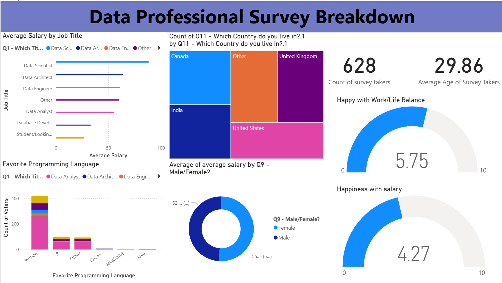

# 📊 Data Professional Survey Breakdown - Power BI Dashboard

This project presents a Power BI dashboard created from a dataset on **Data Professionals Survey**.  
The goal of this project is to analyze and visualize insights about data professionals' job titles, salaries, work-life balance, favorite programming languages, and demographics.  

---

## 📷 Dashboard Preview

---

## 📂 Project Files
- `Power BI - Final Project.xlsx` → Dataset used for analysis  
- `Dashboard.png` → Screenshot of the Power BI Dashboard  

---

## 🔍 Insights from the Dashboard
1. **Average Salary by Job Title** – Data Scientists earn the highest salaries among all job roles.  
2. **Country Distribution** – Respondents are mainly from the US, UK, Canada, and India.  
3. **Favorite Programming Language** – Python is the most preferred language among data professionals.  
4. **Work-Life Balance & Salary Satisfaction**  
   - Avg. Work-Life Balance: **5.75/10**  
   - Avg. Salary Satisfaction: **4.27/10**  
5. **Demographics**  
   - Average Age of respondents: **29.86 years**  
   - Total Survey Takers: **628**  

---
